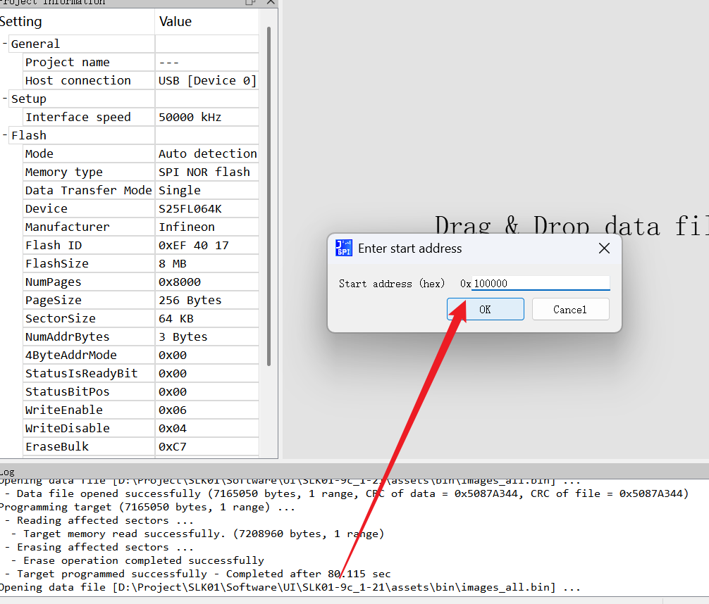
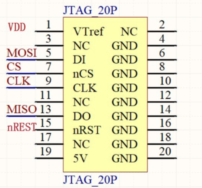

使用SquareLine制作lvgl时，图片太大时烧录一直比较头疼。

针对这个问题我用ai做了一个脚本，可以把图片直接转成RGB565A8的格式，是lvgl官方的格式

lvgl的rgb结构
https://docs.lvgl.io/8.0/overview/image.html
## 1、输入文件
一个包含图片的文件夹
## 2、输出文件
* 一个·c文件
  * 包含一个结构体，内容是图片的大小、宽、高、lvgl的格式、以及偏移地址（动态更改）  
  ```
  const lv_img_dsc_t ui_img_9c_png = {
    .header.always_zero = 0,
    .header.w = 348,
    .header.h = 96,
    .data_size = 100224,
    .header.cf = LV_IMG_CF_TRUE_COLOR_ALPHA,
    .data = (const uint8_t *)(0x00000000UL+IMG_ADD_FLASH)
    };
  ```
+ 一个bin文件夹
    * 是否需要导出每个图片单独的bin
    * 所有图片bin

## 3、使用SquareLine正常更新ui的步骤

### 1、导出ui以后先使用add-meter-code.py添加仪表组件（由于squareline没有meter仪表）

### 2、使用conver_image.py合并图片bin固件，并导出.c文件

### 3、使用keil添加.c文件编译


## 4、烧录图片bin

### 1、先烧录非boot程序到内部flash，失能qspi——flash，否则上电就运行app导致jflash读不到qspi。（作者使用的是bootloader+APP的方案）

### 2、使用jflash配合jlink烧写bin固件，需要指定起始烧录地址


### 3、jflash烧录图像--引脚
https://blog.csdn.net/qq_42017143/article/details/123406290



### 4、keil更改.c文件，编译烧录（烧录前需要给jflash的cs和gnd断）

### 5、烧录bootloader启动屏幕


